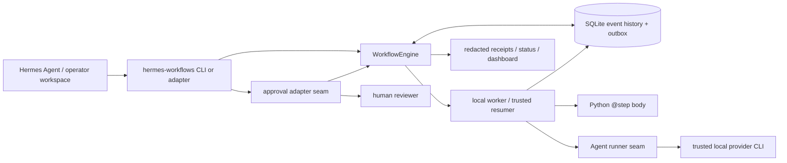
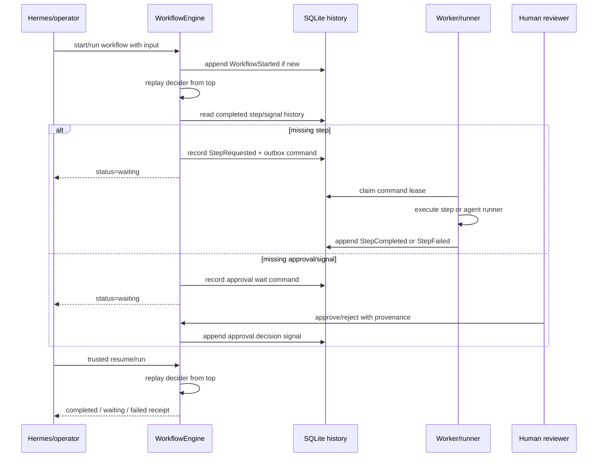

# Domain model, architecture seams, and failure modes

`hermes-workflows` is a small durable workflow runtime for Hermes-operated workspaces. It keeps workflow state in SQLite, replays Python deciders from recorded history, and forces human/agent boundaries to be explicit.

## Architecture overview



The runtime is intentionally boring. It stores state, memoizes completed work, claims commands, records approval provenance, and exposes status. Hermes skills, subagents, prompts, and review loops remain responsible for planning quality and agent behavior.

## Runtime loop



A workflow function is a **decider**, not a long-lived coroutine. It may look like normal async Python, but on every run the engine replays from the top. Awaited work that already completed resolves from history. Awaited work that has not completed records a command or signal wait and exits cleanly.

## Domain objects

| Object | What it represents | Owned by |
| --- | --- | --- |
| `@workflow` function | Deterministic decider that describes control flow | User/workflow author |
| `@step` function | Durable unit of Python work, memoized by step key | Runtime + worker process |
| `WorkflowEngine` | Synchronous API for start/run/signal/status/approval | Runtime |
| Workflow instance | One workflow id, input, status, result/error, waiting state | Runtime SQLite DB |
| Event history | Append-only-ish facts used for replay | Runtime SQLite DB |
| Outbox command | Pending/running step, approval notification, or child-workflow command | Runtime SQLite DB |
| Worker lease | Claim on an outbox command with timeout/attempt metadata | Runtime SQLite DB + worker |
| `ApprovalDecisionInput` | Typed human decision with source provenance | Approval adapter/Hermes plugin/CLI |
| `ApprovalReceipt` | Status summary after recording an approval | Runtime |
| `agent(...)` | Durable request to an external agent runner | Workflow author + runtime |
| `SubprocessAgentRunner` | JSON-over-stdin/stdout boundary to trusted local command | Operator workspace |
| `WorkflowRegistry` | Local aliases for workflow refs and DBs | Hermes/operator workspace |
| Receipt/status/dashboard | Redacted review and audit surfaces | Runtime/adapters |

## Execution environments

### Workflow decider code

Workflow modules are imported and executed in the Python process that calls the runtime API. Today that is usually one of:

- `hermes-workflows run ...`
- `hermes-workflows start ...`
- `hermes-workflows worker ...`
- `hermes-workflows worker --config ...` for resident continuation
- an embedding Hermes plugin/adapter that calls `WorkflowEngine`

There is no implemented `hermes workflows` wrapper in this repository at the time of this documentation. Use `hermes-workflows` or `python -m hermes_workflows` from a trusted Hermes workspace unless/until a Hermes wrapper lands and is tested.

### Step bodies

Normal `@step` bodies execute locally in the worker/resumer process that drains the command. They are not sandboxed by `hermes-workflows`; operators should treat workflow code as trusted Python code with the permissions of that process.

### Agent steps

`agent(...)` does not call a model by itself. It records a durable request and requires a configured agent runner. The built-in `SubprocessAgentRunner` lives in `hermes_workflows.agent_runner`; `hermes_workflows.runners` is a compatibility re-export. The same canonical implementation can run a provider directly with JSON stdin/stdout or run the worker's adapter path with prompt/model argument expansion:

```mermaid
flowchart LR
    AS[agent(...) request] --> SR[SubprocessAgentRunner]
    SR -->|JSON stdin| C[trusted local CLI]
    C -->|JSON stdout| SR
    SR -->|validated output + provenance| DB[(StepCompleted event)]
    SR -->|timeout / non-zero / invalid output| F[(StepFailed / command error)]
```

Provider credentials are owned by the provider CLI or the Hermes/operator environment. The runtime should not mint, persist, or silently forward secrets beyond the explicit local process environment chosen by the operator.

### Approval decisions

Approval adapters record human provenance. Review actions default to immediate continuation (`resume=true`) because operators expect the run to move after they respond. A remote or untrusted adapter can pass `resume=false` for record-only behavior, then the resident `hermes-workflows worker --config ...` process observes the durable response/decision and continues the workflow from the same registry/DB.

## Seams and extension points

| Seam | Current shape | Safety expectation |
| --- | --- | --- |
| Workflow refs | `module:function` import strings | Import only trusted local code |
| Registry | `.hermes/workflows.registry.json` aliases | Keep DB paths/operator policy local |
| Worker loop | CLI/API command claiming and leases | Commands may retry; step bodies should be idempotent or guarded |
| Agent runner | `SubprocessAgentRunner([...])` | Pass argv lists, not shell strings; bound time/output; validate JSON |
| Provider CLI adapter | `hermes-workflows-agent-cli-adapter` | Provider must return exactly one JSON object with `output` |
| Approval adapter | `ApprovalDecisionInput` / `submit_approval_decision` | Require human source fields and idempotency keys |
| Dashboard | static render or local server | Read-only by default; approval POSTs require explicit opt-in |
| Receipts | redacted JSON summaries | Do not use full receipts for private data unless explicitly intended |

## Failure modes

### Decider/import failures

If a workflow ref cannot be imported, the CLI exits with an import error before it can replay that workflow. Keep workflow refs stable, include the source checkout on `PYTHONPATH` when running from a tree, and prefer installed examples for user quickstarts.

If decider code changes incompatibly with existing history, replay can fail or wait on different keys. The current runtime does not implement workflow versioning/determinism guards, so operators should treat workflow code changes as migrations for any live workflow instances.

### Step failures

A normal step can fail because the Python body raises, the process exits, or a worker lease expires before completion. Inspect with:

```bash
hermes-workflows status --db <workflow.sqlite> --id <workflow-id> --commands failed
hermes-workflows events --db <workflow.sqlite> --id <workflow-id> --limit 50
hermes-workflows outbox --db <workflow.sqlite> --id <workflow-id>
```

The outbox/history is the source of truth. Do not assume a chat notification or dashboard row means the workflow is still actively waiting; use status diagnostics to distinguish active waits from stale commands.

### Agent step failures

Agent steps fail closed. `SubprocessAgentRunner` treats these as failures rather than ambiguous partial success:

- command not found
- non-zero exit status
- timeout
- invalid or chatty JSON
- missing required `output`
- non-object provenance
- stdout larger than the configured limit

The runtime may include bounded stdout/stderr tails and command metadata in diagnostics, but it should not dump the subprocess environment. If an agent generated code, that output is still just data until a workflow explicitly gates import/execution behind review and approval.

### Approval failures

Approval decisions can fail when:

- the external decision provenance is missing or malformed
- a duplicate or conflicting decision is submitted for the same key
- the workflow is already terminal
- a record-only adapter stores the approval but no trusted resumer runs afterward

Use idempotency keys tied to the source message/event. If an adapter cannot safely run local continuation itself, pass `resume=false` and rely on the resident worker.

### SQLite and workspace failures

The SQLite DB path is local operator state. Failures include unwritable parent directories, stale local files, deleted DBs, or running a command against the wrong workspace. A Hermes workspace should keep workflow DBs and registry config under a deliberate location such as `.hermes/` and pass explicit `--db` or registry aliases in automation.

## Examples directories

There are two examples locations by design:

- `src/hermes_workflows/examples/` contains tiny installed/importable examples. These are safe for README quickstarts because `python -m pip install .` makes refs like `hermes_workflows.examples.reviewable_draft:reviewable_draft_workflow` importable.
- `examples/` contains source-tree demos, deterministic fake runners, prompt files, generated-output helpers, repo-workflow experiments, and larger scenario material. These examples are useful for contributors and dogfooding, but many assume `PYTHONPATH=src:.` or a source checkout.

Keep user-facing quickstarts on installed examples unless the reader is explicitly working as a contributor from the repository tree.

## Current limitations

- No workflow versioning/determinism guard yet.
- Worker retry/backoff policy is intentionally small.
- Local `ctx.gather(...)` drain is still serial even though the durable model records fan-out.
- Approval policy is provenance-oriented, not a full authorization engine.
- There is no Hermes CLI wrapper named `hermes workflows` in this repo yet.
- `hermes-workflows` is not a sandbox; trusted local Python and CLI commands run with local process permissions.
