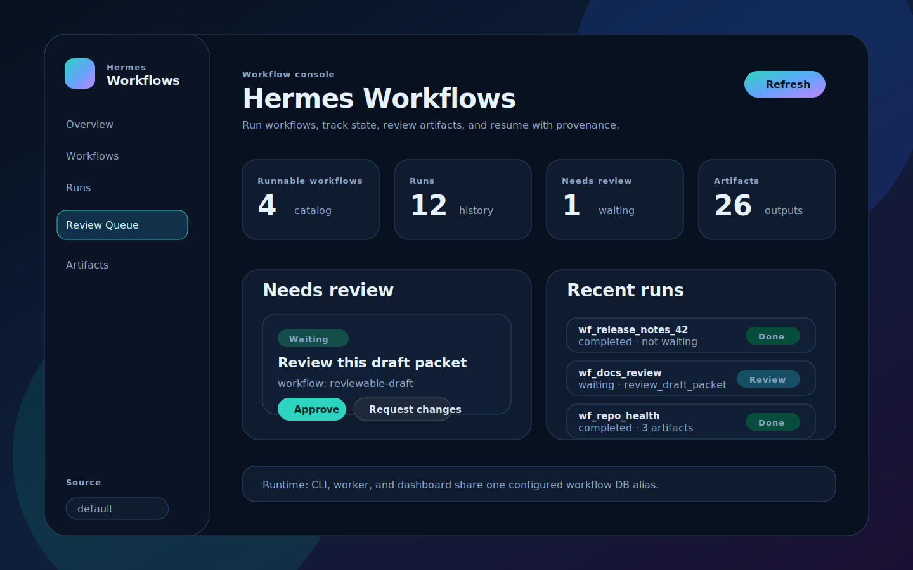
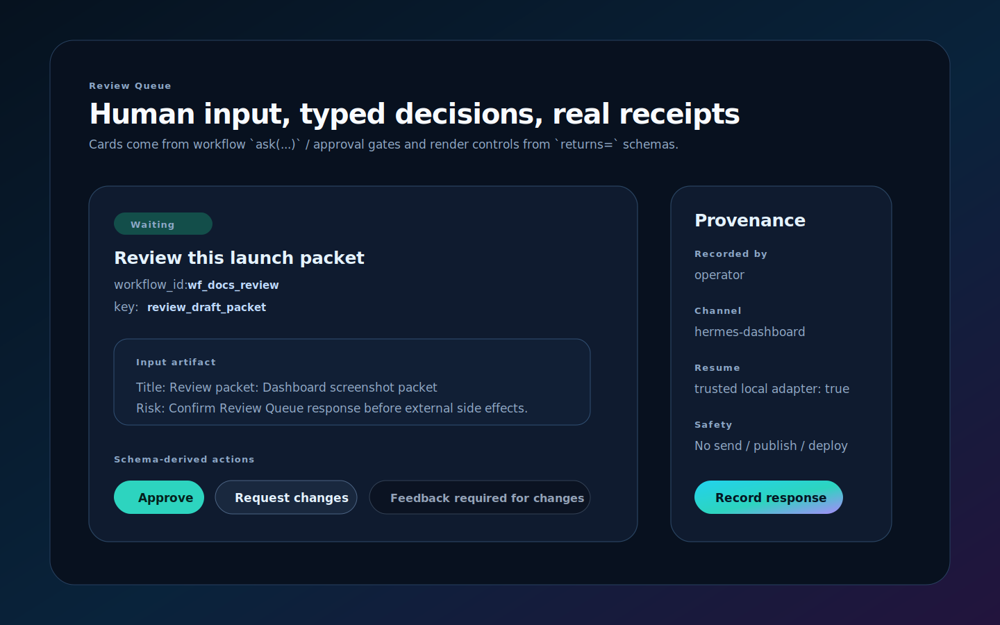
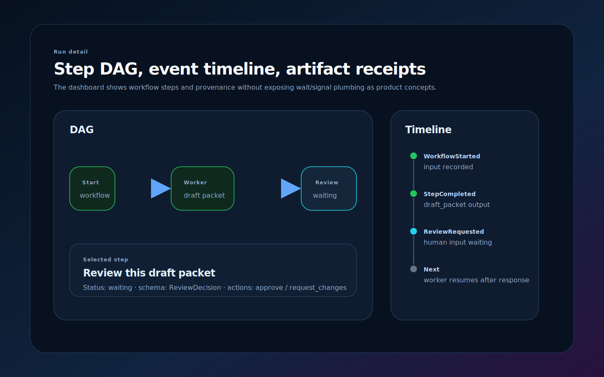

# Hermes Agent Review Queue plugin

`hermes-workflows` ships a thin Hermes Agent plugin for workflow review surfaces. The plugin does not make Hermes the workflow runtime. It lists Review Queue requests and records human responses/approval decisions against configured workflow DB aliases; the resident Workflow Worker owns continuation.

<div class="disclaimer" markdown="1">
**Affiliation disclaimer:** Hermes Workflows is an independent project by Skylar Payne. It is not affiliated with, endorsed by, sponsored by, or officially connected to Nous Research or the Nous Research Hermes Agent project.
</div>

The core package does not import Hermes. Hermes discovers the adapter through the `hermes_agent.plugins` Python entry point:

```toml
[project.entry-points."hermes_agent.plugins"]
hermes-workflows-approvals = "hermes_workflows.hermes_plugin_approvals"
```

## Install

From a checkout:

```bash
cd /path/to/hermes-workflows
pip install -e '.[dev]'
```

Hermes will discover the plugin when that environment is on the active Hermes Python path. In local development, the simplest path is running Hermes from the same venv where `hermes-workflows` is installed.

## Configure workflow DBs and catalog

The plugin can use an explicit SQLite path for low-level tool calls, but dashboard routes should use aliases and catalog entries. The CLI, resident worker, and dashboard must point at the same DB; otherwise the dashboard will show an empty Review Queue while work is waiting elsewhere.

Hermes config shape:

```yaml
plugins:
  enabled:
    - hermes-workflows-approvals
  entries:
    hermes-workflows-approvals:
      workflow_dbs:
        - name: default
          path: /absolute/path/to/workspace/.hermes/workflows.sqlite
      workflow_catalog:
        - name: reviewable-draft
          workflow_ref: hermes_workflows.examples.reviewable_draft:reviewable_draft_workflow
          db: default
          project_root: /absolute/path/to/workspace
          python_paths:
            - /absolute/path/to/hermes-workflows/src
      # Required for dashboard Review Queue action buttons.
      # The browser does not choose identity; the server stamps this id.
      dashboard_approver_id: operator
```

Environment fallback for tests/scripts:

```bash
export HERMES_WORKFLOWS_DBS='{"default":"/absolute/path/to/workspace/.hermes/workflows.sqlite"}'
export HERMES_WORKFLOWS_CATALOG='[{"name":"reviewable-draft","workflow_ref":"hermes_workflows.examples.reviewable_draft:reviewable_draft_workflow","db":"default","project_root":"/absolute/path/to/workspace"}]'
export HERMES_WORKFLOWS_DASHBOARD_APPROVER_ID=operator
```

`workflow_catalog` gives dashboard run/source/resume routes enough import context to resolve workflow code without asking operators to pass local persistence paths. Include `project_root`, `python_paths`, `repo_path`, or `cwd` when the workflow source is not importable from the Hermes process by default.

## Hermes dashboard plugin

The dashboard extension lives under `plugins/hermes-workflows-approvals/dashboard/`:

```text
plugins/hermes-workflows-approvals/
  plugin.yaml
  __init__.py
  dashboard/
    manifest.json
    plugin_api.py
    dist/index.js
    dist/style.css
```

Install it into a Hermes profile by copying or symlinking the plugin directory into that profile's plugin root:

```bash
mkdir -p ~/.hermes/profiles/<profile>/plugins
cp -R plugins/hermes-workflows-approvals ~/.hermes/profiles/<profile>/plugins/
hermes -p <profile> plugins enable hermes-workflows-approvals
```

Dashboard discovery is runtime-only: Hermes scans `$HERMES_HOME/plugins/<name>/dashboard/manifest.json`, serves the JS/CSS bundle, and mounts `plugin_api.py` under `/api/plugins/hermes-workflows-approvals`. No dashboard source fork or npm build is required for normal installation.

The dashboard tab at `/workflows` shows:

- active configured workflow source alias and existence status
- Review Queue requests from `ask(...)` and approval gates
- workflow waiting/running/completed state
- recent events and command diagnostics
- redacted artifacts and request schemas
- trusted review/approval actions that stamp human provenance and resume through the configured workflow source

Dashboard HTTP APIs are intentionally alias-only. They reject arbitrary SQLite paths because dashboard routes run inside the Hermes process and must not become local file readers/writers.

Dashboard buttons are disabled unless `dashboard_approver_id` or `HERMES_WORKFLOWS_DASHBOARD_APPROVER_ID` is configured server-side. The backend stamps provenance like `source={kind: human, id: <configured id>, channel: hermes-dashboard}` and records the decision/response. Review actions default to `resume=true` so the configured workflow source can enqueue or run the next continuation immediately. Remote or untrusted adapters can pass `resume=false` when they need record-only behavior.

## Dashboard screenshots

These screenshots use sanitized example workflow data. They show the intended operator surface: source aliases, run status, Review Queue cards, schema-derived actions, and run detail receipts.

<div class="screenshot-grid" markdown="1">
<figure>
  
  <figcaption>Overview: configured source, Review Queue count, recent runs, and artifact totals.</figcaption>
</figure>

<figure>
  
  <figcaption>Review Queue: typed human input with schema-derived action buttons and provenance.</figcaption>
</figure>

<figure>
  
  <figcaption>Run detail: step-only DAG, event timeline, and artifact receipts.</figcaption>
</figure>
</div>

## Public plugin tools

### `workflow_review_requests_list`

Lists bounded, redacted Review Queue cards from a configured DB alias or explicit SQLite path.

Input:

```json
{
  "db": "default",
  "status": "waiting",
  "limit": 20
}
```

Output includes request metadata, schema, input surface descriptors, redacted artifacts, and exact workflow/key handles for responding.

### `workflow_review_respond`

Records a typed response for an `ask(...)` Review Queue request with human provenance.

Input:

```json
{
  "db": "default",
  "workflow_id": "wf_blog",
  "key": "review_outline",
  "payload": {"action": "request_changes", "feedback": "Make the spine less generic."},
  "by": "operator",
  "channel": "discord",
  "message_id": "...",
  "resume": true
}
```

`resume` defaults to `true`, so the run continues immediately when the adapter is allowed to execute local workflow continuation. Pass `resume=false` only for remote/untrusted record-only adapters.

### `workflow_approval_decide`

Records an approve/reject decision for an approval gate with human provenance.

Input:

```json
{
  "db": "default",
  "workflow_id": "wf_publish_packet",
  "key": "approve_publish_packet",
  "action": "approve",
  "by": "operator",
  "channel": "discord",
  "message_id": "...",
  "resume": true
}
```

`resume` defaults to `true`, so the run continues immediately when the adapter is allowed to execute local workflow continuation. Pass `resume=false` only for remote/untrusted record-only adapters.

The product surface is the Review Queue plus `workflow_review_requests_list`, `workflow_review_respond`, and `workflow_approval_decide`.

## Gateway hook

The plugin registers `pre_gateway_dispatch`, but it deliberately refuses fuzzy approvals.

Handled:

```text
hwf-approval:v1:approve:<structured-token>
hwf-approval:v1:reject:<structured-token>
```

Ignored:

```text
yes
looks good
approve it
sure
```

On exact token match, the hook records the decision with gateway provenance and returns:

```json
{
  "action": "skip",
  "reason": "workflow approval decision recorded"
}
```

Otherwise it returns no-op so normal Hermes processing continues.

## Safe smoke

```bash
SMOKE_DIR=$(mktemp -d)
mkdir -p "$SMOKE_DIR/.hermes"
cat > "$SMOKE_DIR/.hermes/workflows.registry.json" <<'JSON'
{
  "dbs": {"default": "workflows.sqlite"},
  "workflows": {
    "reviewable-draft": {
      "workflow_ref": "hermes_workflows.examples.reviewable_draft:reviewable_draft_workflow",
      "db": "default"
    }
  }
}
JSON

hermes-workflows run reviewable-draft \
  --config "$SMOKE_DIR/.hermes/workflows.registry.json" \
  --id wf_review_smoke \
  --input-json '{"topic":"Review Queue smoke","approver":"human:operator"}'

# Drain queued workflow/agent work until the Review Queue request exists.
hermes-workflows worker \
  --config "$SMOKE_DIR/.hermes/workflows.registry.json" \
  --worker-id review-smoke-worker \
  --max-commands 5 \
  --idle-exit-after 0.1

export HERMES_WORKFLOWS_DBS="{\"default\":\"$SMOKE_DIR/.hermes/workflows.sqlite\"}"
python - <<'PY'
from hermes_workflows.hermes_plugin_approvals import _handle_workflow_review_requests_list, _handle_workflow_review_respond

print(_handle_workflow_review_requests_list({"db":"default"}))
print(_handle_workflow_review_respond({
    "db":"default",
    "workflow_id":"wf_review_smoke",
    "key":"review_draft_packet",
    "payload":{"action":"approve", "feedback": None},
    "by":"operator",
    "channel":"local-smoke",
    "message_id":"smoke-1",
    "resume": False,
}))
PY
```

Expected: the Review Queue lists the waiting typed review request, the response is recorded with provenance, and the workflow remains waiting/runnable until a trusted worker continues it.

## Boundaries

- No Hermes imports in `hermes-workflows` core runtime.
- No fuzzy chat parsing.
- No public mutation, sends, publishing, deploys, or payments.
- No downstream workflow execution from gateway/dashboard callbacks by default.
- Review Queue cards/buttons are convenience surfaces over the canonical workflow state, not a separate source of truth.
- CLI, worker, dashboard, and Review Queue must share the same configured DB alias for a given run.
