# Agent / parallel / pipeline API visual plan

Status: implemented on branch `api-agent-parallel-pipeline`
Date: 2026-06-12
Companion grill doc: [Agent / parallel / pipeline API grill](../architecture/agent-parallel-pipeline-api-grill.html)
Related issue: [#69](https://github.com/skylarbpayne/hermes-workflows/issues/69)

## The picture in one sentence

Make workflow authoring look like a durable Python harness that coordinates **agents**, **parallel fan-out**, **pipelines**, and **human approvals**; keep waits, signals, handoffs, leases, replay, and outbox machinery below the floorboards.

## Implementation status

Implemented on branch `api-agent-parallel-pipeline` in one coherent PR-sized change, not split across timid fragments.

Implemented surface:

```python
research = await agent("research", prompt="Research typed workflows", input=brief, context=[...], returns=ResearchPacket)
sections = await parallel([agent("draft_section", prompt=f"Draft {s}", input=s, key_by=s.slug, returns=SectionDraft) for s in sections])
final_sections = await pipeline(sections, humanize_section, evidence_check_section, limit=4)
await approve_until("approve_final", draft, prompt="Approve final draft")
```

Durability rule: saved outputs replay only when the stored request fingerprint still matches the current rendered prompt, input, context hashes, return schema, and runner options.

Verification on this branch: `271 passed, 2 skipped`.

```mermaid
flowchart TB
    subgraph Author["Author-facing workflow language"]
        W["@workflow async def blog_post(...)"]
        A["agent('research')"]
        P["parallel([...], limit=4)"]
        L["pipeline(items, stages...)"]
        H["approve / approve_until"]
        S["step(local_python)"]
        W --> A
        W --> P
        W --> L
        W --> H
        W --> S
    end

    subgraph PublicGraph["Public run graph"]
        G1["agent step"]
        G2["fan-out block"]
        G3["pipeline stage"]
        G4["approval gate"]
        G5["local step"]
    end

    subgraph Runtime["Runtime substrate — not normal author language"]
        R1["event history"]
        R2["memoized replay"]
        R3["outbox commands"]
        R4["worker leases"]
        R5["signals / waits"]
        R6["approval provenance"]
    end

    A --> G1
    P --> G2
    L --> G3
    H --> G4
    S --> G5

    G1 --> R1
    G2 --> R1
    G3 --> R1
    G4 --> R6
    G5 --> R1
    R1 --> R2
    R3 --> R4
    R5 --> R2

    classDef author fill:#e0f2fe,stroke:#0284c7,color:#0f172a
    classDef graph fill:#dcfce7,stroke:#16a34a,color:#0f172a
    classDef runtime fill:#fee2e2,stroke:#dc2626,color:#0f172a
    class W,A,P,L,H,S author
    class G1,G2,G3,G4,G5 graph
    class R1,R2,R3,R4,R5,R6 runtime
```

## Visual vocabulary

Use these words in docs, code comments, dashboard labels, and issue titles.

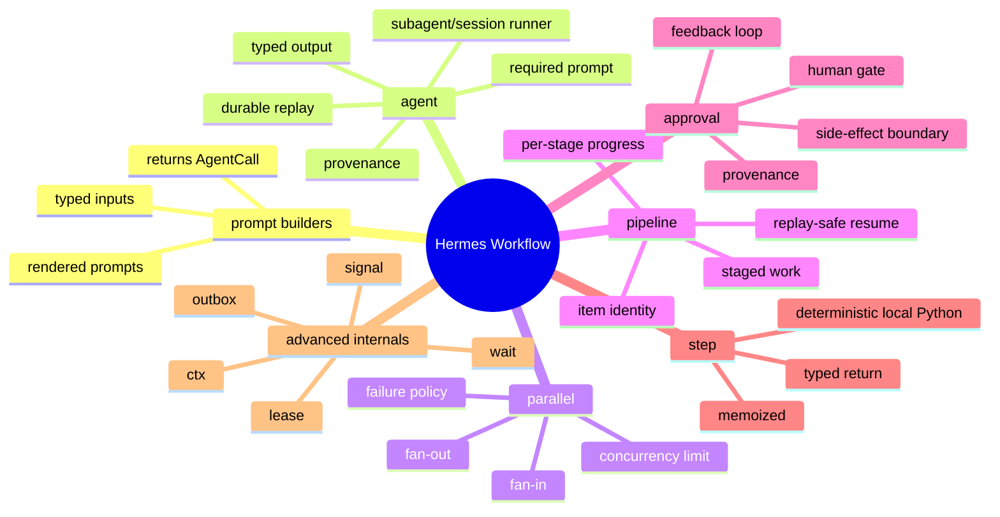

## Blog workflow topology we want authors to see

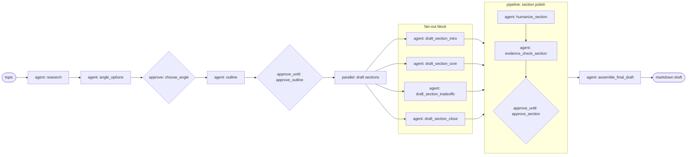

The visible shape is **research → approval → parallel drafting → staged polish → approval → final draft**.

The invisible shape is command rows, signals, and replay checkpoints. Those are diagnostics, not the authoring API.

## Primitive map

| Primitive | Author sees | Runtime records | Dashboard should show |
| --- | --- | --- | --- |
| `agent(...)` | “Run this agent step with this prompt/input/schema.” | Rendered prompt, input snapshot, context digest, output, provenance, artifacts, runner metadata. | One agent step card with prompt/context receipt, logs/artifacts/output. |
| `parallel(...)` | “Run these independent calls together.” | A fan-out/fan-in group plus child step events. | Block with child statuses and concurrency. |
| `pipeline(...)` | “Apply stages to items.” | Stage/item progress, results, failures, resumable keys. | Matrix or swimlane: items × stages. |
| `approve(...)` | “Human picks/accepts/decides.” | Approval request, decision, provenance, idempotency. | Approval card with consequence and source. |
| `approve_until(...)` | “Loop until accepted.” | Attempts, feedback, revision linkage. | Approval gate with attempts/feedback history. |
| `step(...)` | “Run local deterministic Python.” | Step request/result/error. | Plain local step card. |

## Layering plan

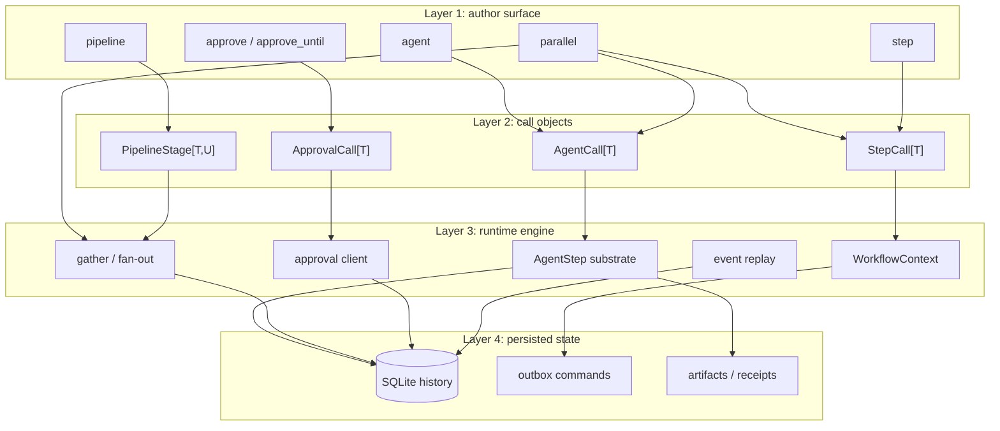

Key design decision: top-level functions create **awaitable call objects**. Awaiting a call executes through the ambient workflow runtime. `parallel(...)` and `pipeline(...)` can accept not-yet-awaited calls and launch them with durable fan-out semantics. `agent(...)` requires a prompt; higher-order prompt-builder helpers are just normal Python functions that format prompts from structured inputs and return `AgentCall[T]` objects.

## Context + memoization shape

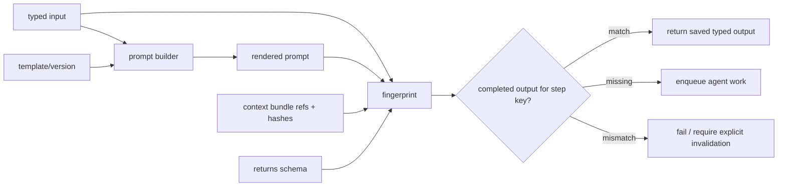

Memoization rule: saved outputs are reused only when the step key and dependency fingerprint match. The fingerprint includes rendered prompt, structured input, context bundle hashes, return schema, and runner-relevant options. Changed context must not silently reuse stale output.

## Lifecycle of one `agent(...)` call

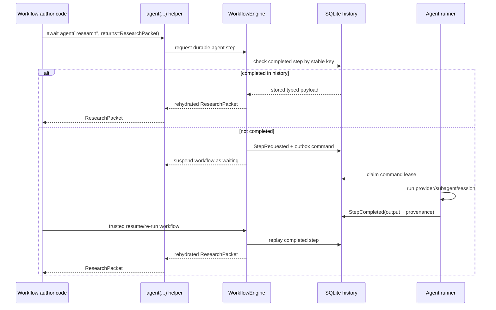

## Lifecycle of a `parallel(...)` fan-out

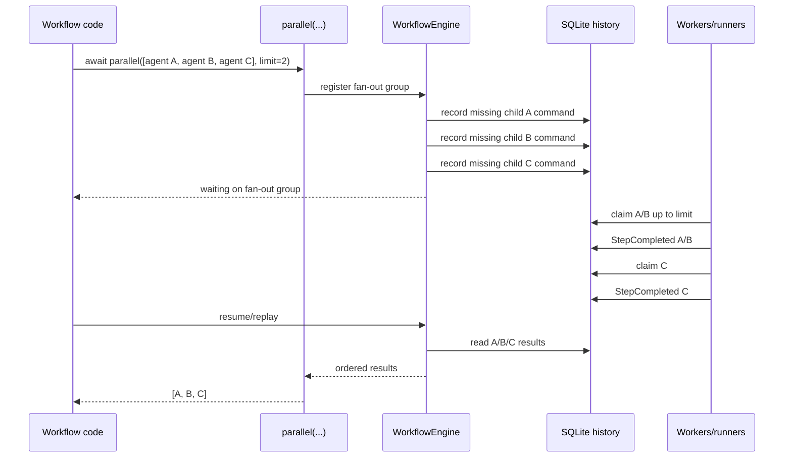

## Lifecycle of a `pipeline(...)`

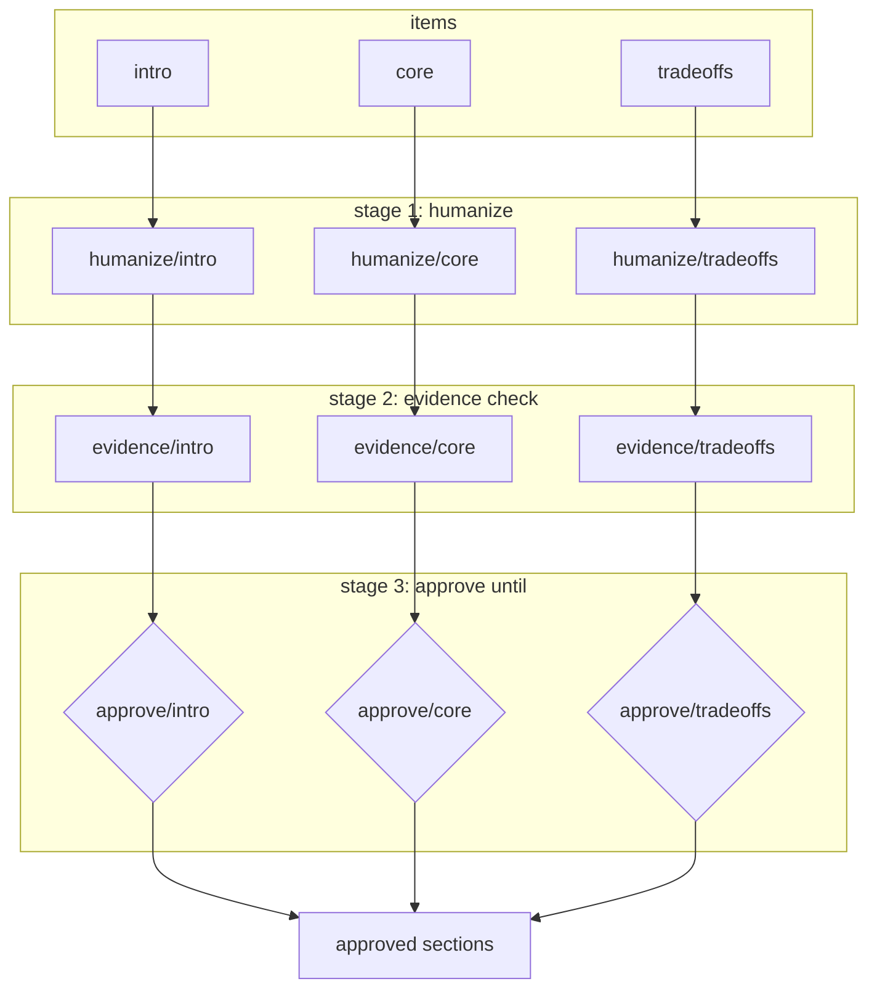

The dashboard can render this as a matrix: rows are items, columns are stages. That is the visual payoff of making `pipeline(...)` first-class instead of hiding it as nested loops.

## Implementation roadmap

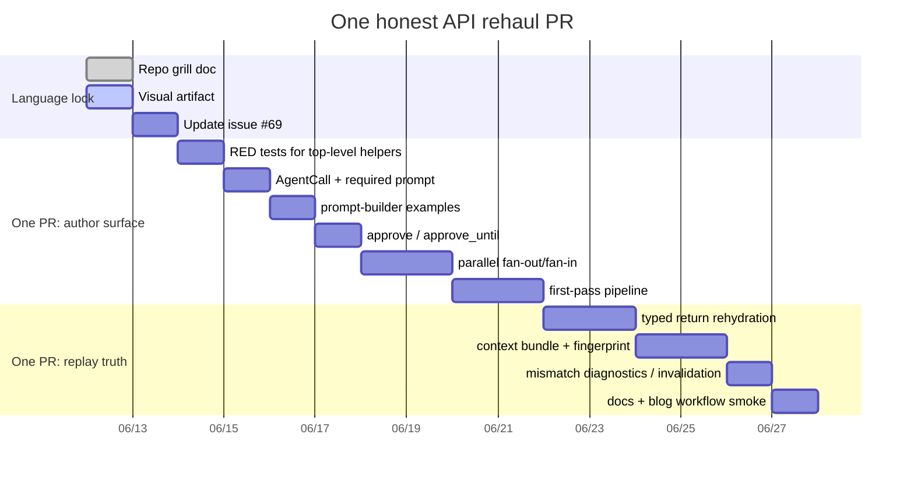

This is one implementation PR, not four product-language fragments. If it starts getting scary, shrink internals — not the shared author vocabulary.

## PR shape board

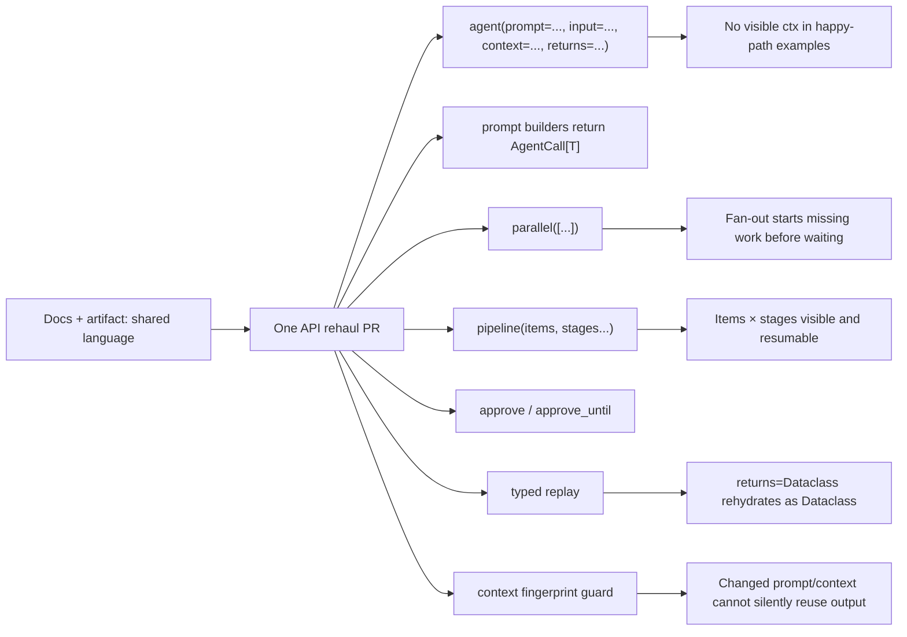

## File touch map

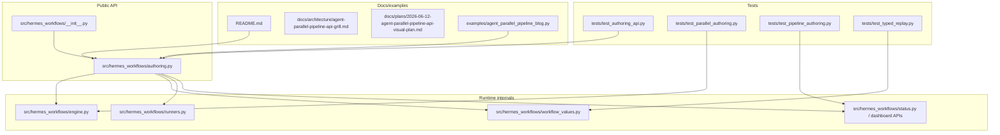

## Decision checkpoints

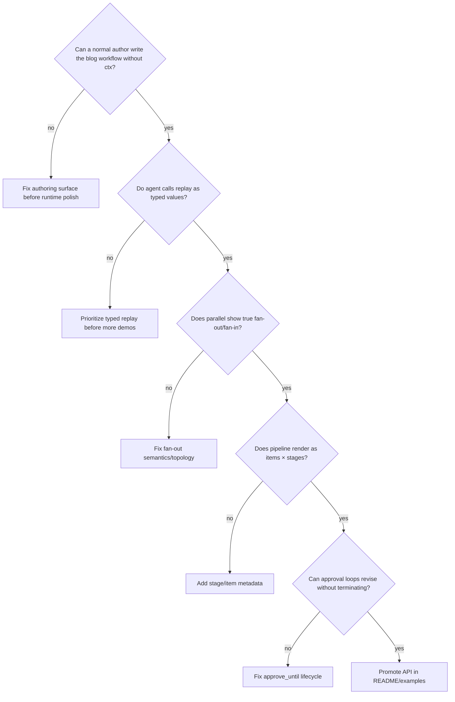

## Design traps to avoid

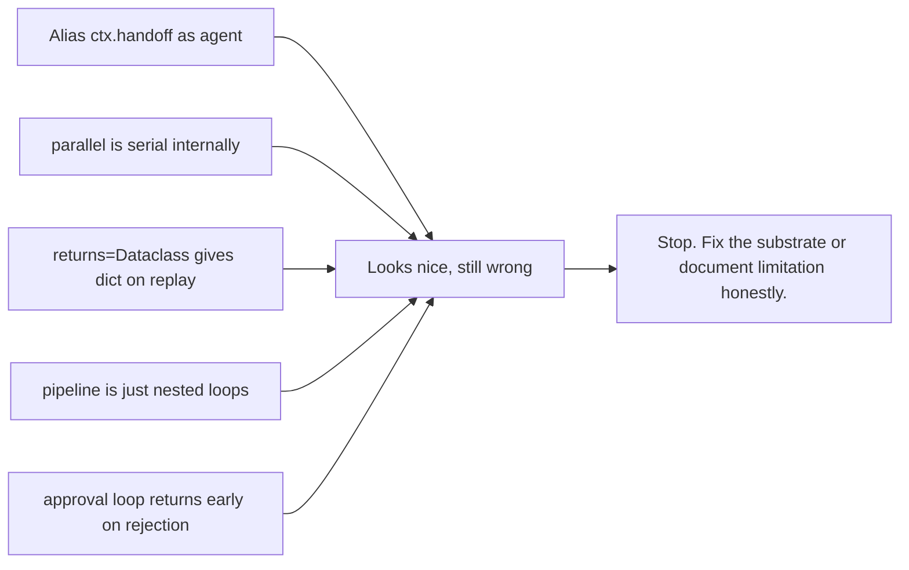

## Acceptance snapshot

A first version is good enough when this code is plausible, tested, and documented:

```python
@workflow(name="blog-post")
async def blog_post(topic: str) -> str:
    research = await agent("research", input=topic, returns=ResearchPacket)
    outline = await agent("outline", input=research, returns=Outline)
    outline = await approve_until("approve_outline", outline)

    drafts = await parallel(
        [agent("draft_section", input=s, key_by=s.slug, returns=SectionDraft) for s in outline.sections],
        limit=4,
    )

    sections = await pipeline(
        drafts,
        agent("humanize", returns=SectionDraft),
        agent("evidence_check", returns=SectionDraft),
        approve_until("approve_section"),
        limit=4,
    )

    return await agent("assemble", input=sections, returns=str)
```

If the implementation cannot make this honest, it is not an API rehaul yet. It is lipstick on a runtime API, and we should call it that before it metastasizes.
