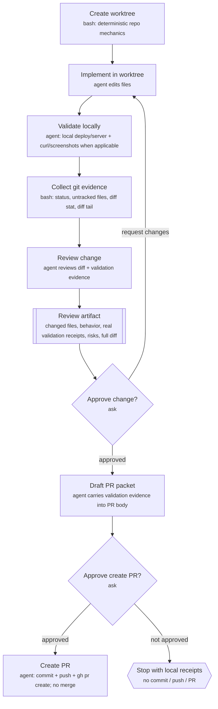
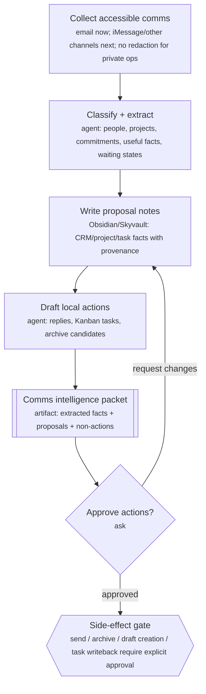
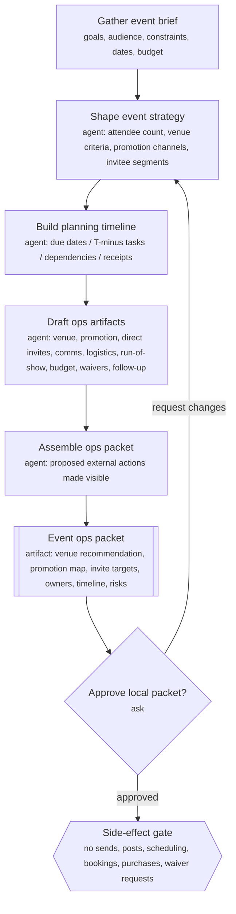

# July 2 Hermes Workflows — Mermaid review map

Core line: **agents do the work; workflows own state, checks, receipts, gates, and side-effect boundaries.**

This replaces the editable canvas. Mermaid is the review source of truth for now because it is lower-friction, diffable, and easy to paste back.

## Content workflow — reusable template

```mermaid
flowchart TD
  c1["Brainstorm topics<br/><small>agent → TopicBrainstormPacket</small>"] -->|options| c2{"Select topic<br/><small>ask</small>"}
  c2 -->|selected topic| c3["Research topic<br/><small>agent → ResearchPacket</small>"]
  c3 -->|source notes + receipts| c4["Brainstorm angles<br/><small>agent → AnglePacket</small>"]
  c4 -->|angle options| c5{"Select angle<br/><small>ask</small>"}
  c5 -->|selected angle| c6["Draft outline<br/><small>agent → OutlinePacket</small>"]
  c6 --> c7{"Approve outline<br/><small>ask</small>"}
  c7 -->|approved| c8["Draft section(s)<br/><small>agent, parallel where safe</small>"]
  c8 --> c9["Humanize section(s)<br/><small>agent: scar tissue + evidence</small>"]
  c9 --> c10{"Review section(s)<br/><small>ask; reject loops only affected section</small>"}
  c10 -->|request changes| c8
  c10 -->|approved sections| c11["Combine approved sections<br/><small>agent → CanonicalDraft</small>"]
  c11 --> c12["Humanize full draft<br/><small>agent: transitions, repetition, voice</small>"]
  c12 --> c13{"Approve canonical draft<br/><small>ask</small>"}
  c13 -->|approved spine| c14["Plan blog visuals<br/><small>agent → VisualElementPlan, model: Gemini Nano Banana 2</small>"]
  c14 --> c15{"Approve visual plan<br/><small>ask</small>"}
  c15 -->|approved| c16["Generate blog visuals<br/><small>agent: Gemini Nano Banana 2 → local image files + receipt</small>"]
  c16 --> c17["Format adapters<br/><small>blogpost uses visuals; slide deck + HyperFrames video package</small>"]
  c17 --> c18[["Local asset packet<br/><small>artifact: manifest, visual receipts, paths, render/check receipts</small>"]]
  c18 --> c19{{"Side-effect gate<br/><small>no publish/upload without explicit approval</small>"}}

```

## Code workflow — hero demo

## Communication workflow — personal-infra extraction demo

## Event workflow — ops packet demo

